# IMET Global Component Relationship Chart

```mermaid
graph TB
    %% Main Layout Components
    Layout[Layout.tsx] --> Navbar[Navbar.tsx]
    Layout --> Footer[Footer.tsx]
    Layout --> ScrollToTop[ScrollToTop.tsx]
    Layout --> DisclaimerPopup[DisclaimerPopup.tsx]

    %% Pages
    HomePage[page.tsx] --> Hero[Hero.tsx]
    HomePage --> Stats[Stats.tsx]
    HomePage --> WhyTwo[WhyTwo.tsx]
    HomePage --> Whyimetglobal[Whyimetglobal.tsx]
    HomePage --> IMETGlobalAdvantage[IMETGlobalAdvantage.tsx]
    HomePage --> CoursesCarousel[CoursesCarousel.tsx]
    HomePage --> Testimonials[Testimonials.tsx]

    %% News Section
    NewsPage[news/page.tsx] --> News[News.tsx]
    News --> NewsCard[NewsCard.tsx]
    News --> LoadingAnimation[LoadingAnimation.tsx]

    %% Course Related Components
    CoursesCarousel --> CourseLinks2[CourseLinks2.tsx]
    CoursesCarousel --> CourseLinks3[CourseLinks3.tsx]
    CoursesCarousel --> CourseLinks4[CourseLinks4.tsx]
    CoursesCarousel --> CourseLinks5[CourseLinks5.tsx]

    %% Educational Components
    QualificationPathway[QualificationPathway.tsx] --> Journey[Journey.tsx]
    QualificationPathway --> ProgramOutcome[ProgramOutcome.tsx]
    QualificationPathway --> QualificationsSection[QualificationsSection.tsx]

    %% Interactive Components
    ChatBot[ChatBot.tsx] --> BotAnimation[BotAnimation.tsx]
    ContactForm[ContactForm.tsx] --> Calendly[Calendly.tsx]

    %% Blog Components
    BlogGrid[BlogGrid.tsx] --> BlogCard[BlogCard.tsx]
    BlogGrid --> InfiniteScroll[InfiniteScroll.tsx]

    %% Feature Sections
    CollaborationSection[CollaborationSection.tsx]
    InnovationCenter[InnovationCenter.tsx]
    JobRolesSection[JobRolesSection.tsx]
    PlacementNumbers[PlacementNumbers.tsx]
    SpecialisationsSection[SpecialisationsSection.tsx]
    SpotlightSection[SpotlightSection.tsx]

    %% UI Components
    subgraph UIComponents
        PopButton[PopButton.tsx]
        PopButtonV2[PopButtonV2.tsx]
        PopButtonV3[PopButtonV3.tsx]
        Popup[Popup.tsx]
        Banner[Banner.tsx]
        Floating[Floating.tsx]
    end

    %% Interactive Features
    subgraph InteractiveFeatures
        Map[Map.tsx]
        VideoSection[VideoSection.tsx]
        cardCarousel[cardCarousel.tsx]
    end

    %% Enrollment Related
    subgraph EnrollmentComponents
        HowtoEnroll[HowtoEnroll.tsx]
        FinancialAssistance[FinancialAssistance.tsx]
        UpcomingSessions[UpcomingSessions.tsx]
    end

    %% FAQ Section
    subgraph FAQComponents
        FAQSection[FAQ's.tsx]
        FAQSComponent[FAQS.tsx]
    end

    %% Data Components
    subgraph DataDisplay
        CohortData[CohortData.tsx]
        Members[Members.tsx]
        Overview[Overview.tsx]
    end

    %% Utility Components
    subgraph Utilities
        ClientOnly[ClientOnly.tsx]
        Flags[Flags.tsx]
        Sidebar[Sidebar.tsx]
    end

    %% Connections between major sections
    HomePage --> CollaborationSection
    HomePage --> InnovationCenter
    HomePage --> JobRolesSection
    HomePage --> PlacementNumbers
    HomePage --> FAQSection
    HomePage --> Map

    %% Mobile Navigation
    Navbar --> Sidebar
    
    %% Interactive Elements
    Hero --> PopButton
    Hero --> VideoSection
    
    %% Enrollment Flow
    HowtoEnroll --> UpcomingSessions
    HowtoEnroll --> FinancialAssistance
    
    %% Data Flow
    Overview --> CohortData
    Overview --> Members
```

## Component Categories and Relationships

### Core Layout Components
- Layout.tsx serves as the main wrapper
- Navbar.tsx handles navigation
- Footer.tsx provides site-wide footer
- ScrollToTop.tsx improves UX
- DisclaimerPopup.tsx shows important notices

### Page Components
- page.tsx (Home Page)
- news/page.tsx (News Section)
- Each page composed of multiple feature sections

### Feature Sections
- Hero Section
- Stats Display
- Why IMET Global
- Courses Overview
- Testimonials
- Collaboration Section
- Innovation Center
- Job Roles
- Placement Statistics

### Interactive Components
- ChatBot with animations
- Contact Form with Calendly integration
- Interactive Maps
- Video Sections
- Carousels

### Educational Content
- Qualification Pathway
- Program Outcomes
- Course Links
- Specializations

### User Interface Elements
- Multiple PopButton variants
- Popup components
- Banner displays
- Floating elements

### Data Display
- Cohort Information
- Member Profiles
- Overview Statistics
- News Cards
- Blog Cards

### Utility Components
- ClientOnly for SSR handling
- Flags for internationalization
- Sidebar for mobile navigation
- Loading animations
- Infinite scroll

## Component Communication

1. **Data Flow**
   - Top-down props passing
   - Context for global state
   - Server components for data fetching

2. **Event Handling**
   - Interactive components use callbacks
   - Form submissions handled by dedicated handlers
   - Popups controlled by global state

3. **Responsive Design**
   - Components adapt to screen size
   - Mobile-first approach
   - Sidebar replaces Navbar on mobile

4. **Performance Optimizations**
   - ClientOnly for client-side rendering
   - Lazy loading for heavy components
   - Infinite scroll for long lists
